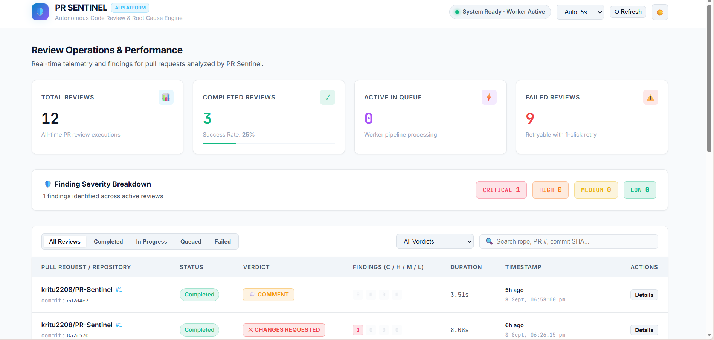
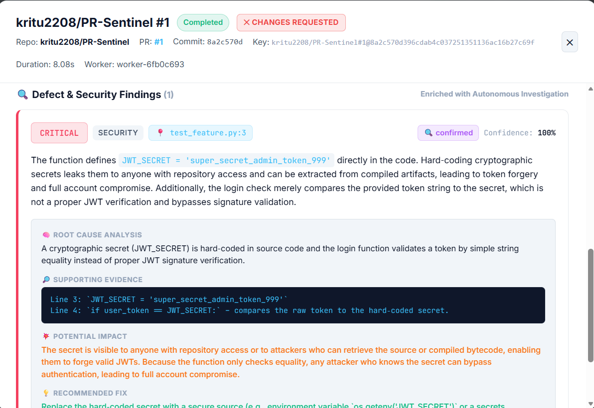
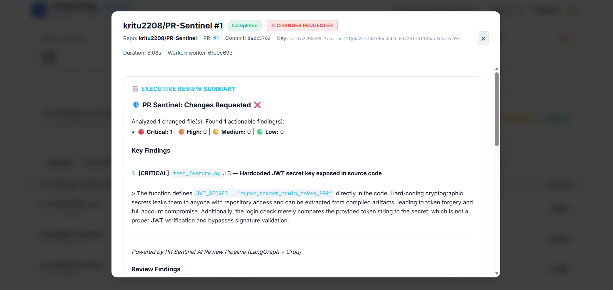
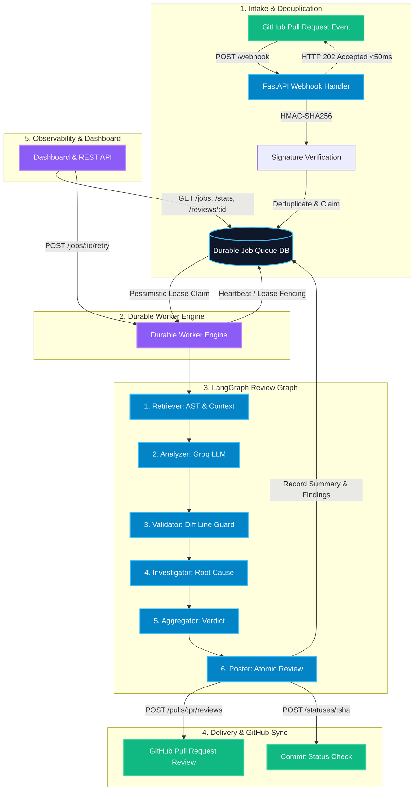

# 🛡️ PR Sentinel — Autonomous AI Code Review & Root Cause Platform

[](https://www.python.org/)
[](https://fastapi.tiangolo.com/)
[](https://langchain-ai.github.io/langgraph/)
[](https://groq.com/)
[](LICENSE)

**PR Sentinel** is a production-grade, autonomous code review platform designed for GitHub Pull Requests. Built with **FastAPI**, **LangGraph**, **Groq LLMs**, and **PostgreSQL / SQLite**, it goes far beyond simple one-shot LLM wrappers by combining deterministic codebase retrieval, structured diff analysis, strict diff-line validation, autonomous root-cause investigation, durable worker scheduling, and an interactive operational dashboard.

---

## 📸 Platform Showcase

### 1. Operations & Queue Telemetry Dashboard
Real-time KPI metrics, active worker heartbeats, finding severity distribution, and recent review job telemetry.



---

### 2. Executive Review Summary & Verdict Inspector
Instant review inspector displaying the overall verdict (`APPROVE`, `REQUEST_CHANGES`, `COMMENT`), risk assessment, and file summaries.



---

### 3. Autonomous Root Cause & Finding Investigation
Deep-dive defect inspection displaying exact diff line location, confidence score, root cause analysis, supporting evidence, potential impact, and actionable code fixes.



---

### 4. GitHub PR Automated Review & Inline Comments
Autonomous multi-line comments and batch review summaries posted directly onto GitHub Pull Request discussion threads.

*(Add your GitHub PR screenshot here as `docs/images/04-github-pr-review.png`)*

---

## 🏗️ Architecture Overview



---

## ⚡ Key Capabilities

- **Sub-50ms Webhook Intake**: Authenticates `X-Hub-Signature-256` HMAC-SHA256 payloads, atomically claims delivery IDs, and acknowledges GitHub with `202 Accepted` immediately without blocking on LLM inference.
- **Durable Worker Queue & State Machine**: Transitions jobs reliably through `QUEUED` $\rightarrow$ `IN_PROGRESS` $\rightarrow$ `COMPLETED` / `FAILED` with zero state loss on server restarts.
- **Lease Fencing & Active Heartbeats**: Workers renew execution leases every 10 seconds. Stale jobs are automatically reclaimed after 300 seconds. Pre-side-effect lease fencing ensures timed-out workers never publish duplicate reviews.
- **Codebase-Aware Context Retrieval**: Deterministically extracts modified imports, symbols, class definitions, and call-sites across repository files using AST parsing and bounded regex extractors.
- **Strict Diff-Line Validation (Zero Hallucinations)**: Validates that all LLM-reported line numbers strictly exist within actual git diff hunks, completely eliminating out-of-bounds line comments.
- **Autonomous Root Cause Investigation**: Re-evaluates validated defect findings against repository context to enrich reports with **Root Cause**, **Supporting Evidence**, **Potential Impact**, and **Actionable Recommendations**.
- **Atomic GitHub Review Batching**: Posts all inline comments, formatted summary, and formal review verdict (`APPROVE`, `REQUEST_CHANGES`, `COMMENT`) in a single atomic GitHub API request.
- **Interactive Developer Dashboard**: Modern Dark/Light SaaS dashboard showing real-time queue telemetry, finding severity breakdown (`CRITICAL`, `HIGH`, `MEDIUM`, `LOW`), deep-dive finding inspection, and 1-click retry.

---

## 🛠️ Technical Stack

| Layer | Technologies |
|---|---|
| **API & Framework** | [FastAPI](https://fastapi.tiangolo.com/), [Pydantic v2](https://docs.pydantic.dev/), Starlette |
| **Orchestration & AI** | [LangGraph](https://langchain-ai.github.io/langgraph/), [ChatGroq](https://python.langchain.com/docs/integrations/chat/groq/) (`openai/gpt-oss-120b`, configurable) |
| **Database & ORM** | [PostgreSQL 14+](https://www.postgresql.org/) / [SQLite](https://www.sqlite.org/), [SQLAlchemy 2.0 (Async)](https://docs.sqlalchemy.org/), [Alembic](https://alembic.sqlalchemy.org/) |
| **HTTP & GitHub Client** | [HTTPX (Async)](https://www.python-httpx.org/), HMAC-SHA256, GitHub REST API v3 |
| **Frontend UI** | Vanilla Semantic HTML5, Modern CSS Design System (Custom Tokens, Dark/Light mode), Vanilla JavaScript |
| **Testing & Quality** | [Pytest](https://docs.pytest.org/), `pytest-asyncio`, `aiosqlite` (113 automated tests) |

---

## 🚀 Local Setup & Quickstart

### 1. Prerequisites
- Python 3.11+
- Groq API Key ([console.groq.com](https://console.groq.com))
- GitHub Personal Access Token (PAT) with `repo` scope

### 2. Clone & Install Dependencies
```powershell
git clone https://github.com/kritu2208/PR-Sentinel.git
cd PR-Sentinel

# Create and activate virtual environment
python -m venv venv
.\venv\Scripts\Activate.ps1   # On Windows
# source venv/bin/activate    # On Linux/macOS

# Install dependencies
pip install -r requirements.txt
```

### 3. Environment Configuration
Create a `.env` file in the root directory:
```ini
GITHUB_TOKEN=ghp_your_github_token_here
GITHUB_WEBHOOK_SECRET=your_webhook_secret_here
GROQ_API_KEY=gsk_your_groq_api_key_here
GROQ_MODEL=openai/gpt-oss-120b
DATABASE_URL=sqlite+aiosqlite:///./pr_sentinel.db
WORKER_MODE=hybrid
ADMIN_API_KEY=
ENABLE_COMMIT_STATUS=false
```

### 4. Start Application
```powershell
# Start FastAPI backend & background worker on port 8080
uvicorn app.main:app --host 127.0.0.1 --port 8080 --reload
```

Open your browser and navigate to:
👉 **`http://localhost:8080/dashboard`**

---

## 📡 Exposing Webhook to GitHub (Live PR Testing)

To connect PR Sentinel with your live GitHub repository:

```powershell
# In a second terminal, start Cloudflare tunnel
.\cloudflared.exe.exe tunnel --protocol http2 --url http://localhost:8080
```

1. Copy the public forwarding URL (e.g. `https://your-tunnel.trycloudflare.com`).
2. Go to your GitHub Repository $\rightarrow$ **Settings** $\rightarrow$ **Webhooks** $\rightarrow$ **Add webhook**.
3. Set **Payload URL** to: `https://your-tunnel.trycloudflare.com/webhook`
4. Set **Content type** to: `application/json`
5. Set **Secret** to match `GITHUB_WEBHOOK_SECRET` in your `.env`.
6. Under events, select **Pull requests**.
7. Open a Pull Request on your repository—PR Sentinel will automatically analyze the diff, post inline comments, and update your dashboard!

---

## 🧪 Testing & Quality Assurance

The project includes an automated test suite covering all nodes, APIs, GitHub interactions, worker fencing, and database migrations:

```powershell
# Run the complete test suite
pytest tests/ -v
```

**Test Suite Status**:
```text
============================= 113 passed in 9.80s =============================
```

---

## 📂 Project Structure

```text
PR-Sentinel/
├── app/
│   ├── main.py                  # FastAPI webhook entry point, dashboard routes, and REST API
│   ├── config.py                # Pydantic Settings and environment configuration
│   ├── github_client.py         # GitHub API client (diffs, contents, reviews, statuses, rate-limits)
│   ├── worker.py                # Durable worker loop, lease heartbeats, fencing, and drainage
│   ├── models.py                # Pydantic models for GitHub webhook payloads
│   ├── schemas.py               # API response models (ReviewDetailResponse, JobStatsResponse, etc.)
│   ├── agent/
│   │   ├── graph.py             # LangGraph StateGraph topology and compilation
│   │   ├── state.py             # ReviewState TypedDict definition
│   │   ├── schemas.py           # Pydantic schemas for findings, verdicts, and investigations
│   │   ├── retrieval.py         # AST/regex symbol extraction & bounded context slicer
│   │   ├── diff_parser.py       # Unified diff parser & hunk line validator
│   │   ├── prompts.py           # Structured analysis prompts & injection protection
│   │   └── nodes/
│   │       ├── retriever.py     # Codebase-aware retrieval node
│   │       ├── analyzer.py      # LLM diff analysis node via Groq
│   │       ├── validator.py     # Hunk line validation and path integrity checks
│   │       ├── investigator.py  # Autonomous root cause & evidence analysis node
│   │       ├── aggregator.py    # Deduplication, prioritization, and verdict determination
│   │       └── poster.py        # Atomic GitHub review publisher & lease fencing
│   ├── db/
│   │   ├── models.py            # SQLAlchemy Base and ReviewJob model
│   │   ├── session.py           # AsyncEngine and AsyncSession lifecycle management
│   │   └── job_store.py         # Durable state operations, atomic claims, and error sanitization
│   └── static/
│       ├── index.html           # Developer dashboard UI
│       ├── style.css            # Dark/Light theme design system
│       └── app.js               # Centralized ApiClient & reactive UI controller
├── docs/
│   └── images/                  # Platform screenshots & UI showcase assets
├── migrations/                  # Alembic schema version history
├── tests/                       # 113 comprehensive unit, integration, API, and migration tests
├── alembic.ini                  # Alembic migration configuration
├── requirements.txt             # Project Python dependencies
└── .env.example                 # Environment configuration template
```

---

## 💼 Why PR Sentinel? (Interview & Portfolio Talking Points)

1. **Resilient Asynchronous Architecture**: Unlike synchronous LLM wrappers that freeze or time out, PR Sentinel uses decoupled webhook intake and persistent background queues.
2. **Deterministic Hallucination Defense**: Strictly validates line numbers against parsed unidiff hunks so comments are never posted on nonexistent or deleted lines.
3. **Autonomous Root Cause Investigation**: Doesn't just find syntax bugs—investigates security flaws, evidence, impact, and generates concrete code remediations.
4. **Production Observability**: Full observability via REST APIs and an operational dashboard for engineering managers and team leads.
